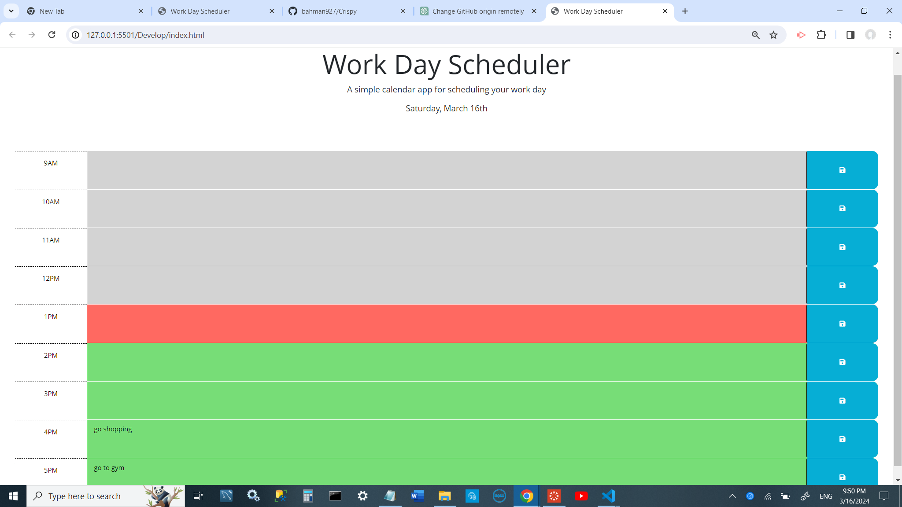

# Work Day Scheduler Starter Code
# 8-Hour Work Day Scheduler

This scheduler allows you to plan your 8-hour work day. Time blocks are color-coded to indicate whether they are in the past, present, or future. Events can be saved to the local storage of your browser.

## Features

- Time blocks are displayed in 60-minute increments.
- Past time blocks are greyed out.
- The current time block is highlighted in red.
- Future time blocks are highlighted in green.
- Events can be saved to the local storage by clicking on a save icon picture.

## Usage

1. Open `index.html` in your browser.
2. Click on a time block to add or edit an event.
3. Click the save button to save the event to the local storage.
4. Refresh the page to see your saved events persist.

## Technologies Used

- HTML
- CSS
- JavaScript

## Screenshots

## Author

Bahman Dorandish

## License

This project is licensed under the MIT License - see the [LICENSE](LICENSE) file for details.

